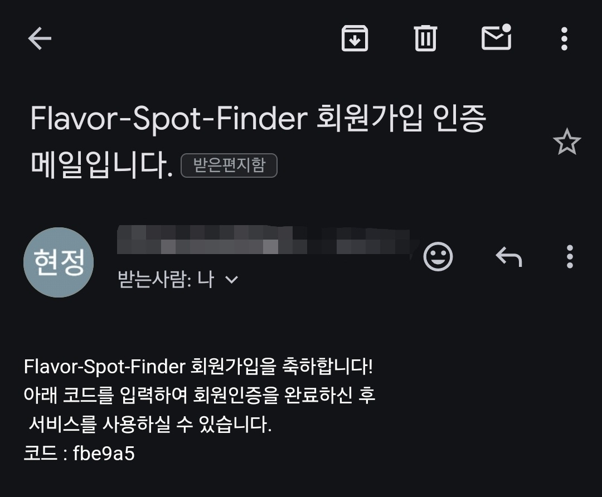

사용자 인증을 위한 이메일을 통한 인증 코드 전송을 진행합니다.

## 메일 인증 설정

### 1. email 전송 서비스 개발

- **목적**: 실제로 사용되는 메일인지 확인을 위한 인증 코드를 포함한 메일을 전송합니다.


- **메소드**: `sendMail(String to, MailComponents subject, MailComponents content)`


- 코드

```java
  /*
   * 이메일을 전송하는 메서드
   * 1) 메일 인증
   * 2) 비밀번호 초기화
   *
   * @param to      수신자 이메일 주소
   * @param subject 이메일 주제
   * @param content    이메일 내용
   */
  public void sendMail(String to, MailComponents subject, MailComponents content) {

      SimpleMailMessage mail = new SimpleMailMessage();

      // 인증 메일을 보내는 경우
      if (subject.equals(VERIFICATION_SUBJECT)) {
          createMail(mail, to, subject, content, 6);
      }

      send(mail);
  }
```


```java
  /*
   * SimpleMailMessage 객체를 생성하는 메서드
   *
   * @param to      수신자 이메일 주소
   * @param subject 이메일 주제
   * @param text    이메일 내용
   * @param length  생성할 인증 코드 길이
   * @return 생성된 SimpleMailMessage 객체
   */
  private SimpleMailMessage createMail(SimpleMailMessage mail,
                                       String to,
                                       MailComponents subject,
                                       MailComponents text,
                                       int length) {
      mail.setTo(to);
      mail.setSubject(subject.getContent());
      // 메일 내용 구성
      mail.setText(String.format(text.getContent(), createUUID(length)));
      return mail;
  }
```


```java
  /*
   * 이메일을 전송하는 메서드
   *
   * @param mail SimpleMailMessage 객체
   */
  private void send(SimpleMailMessage mail) {
      try {
          javaMailSender.send(mail);
      } catch (MailException e) {
          throw new CustomException(EMAIL_SENDING_FAILED);
      }
  }
```

- yml 설정

  ```yml
    mail:
      host: smtp.gmail.com
      port: 587
      username: (@gmail.com 메일)
      password: (16자)
      properties:
        mail:
          smtp:
            auth: true
            starttls:
              enable: true
  ```

### 2. gmail에서 SMTP용 계정 설정


- **방법**
  - 성공적인 메일 전송을 위해서는 메일의 IMAP 설정을 활성화시켜야 합니다.
  - 앱 비밀번호 사용을 위해서 2단계 인증 활성화 > 앱 비밀번호호 16자를 yml에서 사용


### 3. 회원가입에 따른 성공적인 전송



